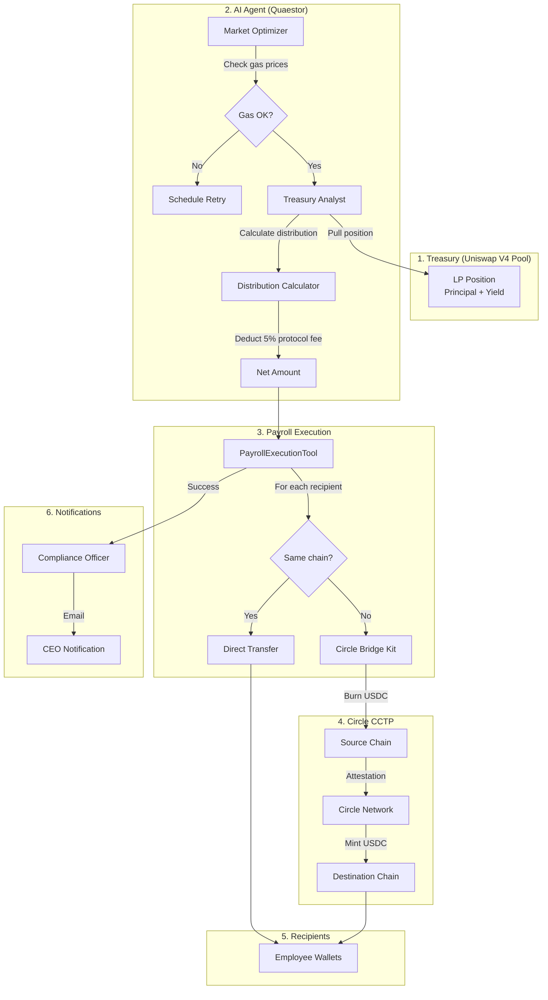
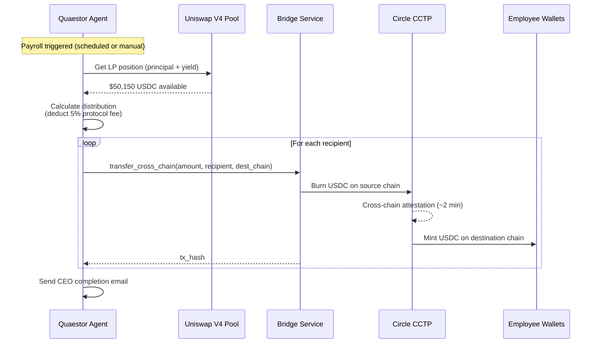

# ArcFlow Payroll - Money Flow

## End-to-End Flow



## Step-by-Step Money Flow

### Step 1: Check Treasury Position
```
Uniswap V4 Pool
├── Principal: $50,000 USDC
├── Yield (LP Fees): $150 USDC
└── Total: $50,150 USDC
```

### Step 2: Calculate Distribution
```
Yield Earned:        $150.00
Protocol Fee (5%):   -  $7.50
─────────────────────────────
Net Yield:           $142.50
Principal:         $50,000.00
─────────────────────────────
Total to Distribute: $50,142.50
```

### Step 3: Get Payroll Recipients
```
Recipients (from smart contract):
├── Employee 1: $1,000 → Base Sepolia
├── Employee 2: $1,500 → Arbitrum Sepolia  
└── Employee 3: $1,200 → Ethereum Sepolia
─────────────────────────────────────────
Total Required: $3,700
```

### Step 4: Execute Payments



## Architecture Components

| Component | Role | Location |
|-----------|------|----------|
| **Quaestor Agent** | AI orchestrator | `agent/src/quaestor/` |
| **TreasuryPositionTool** | Reads Uniswap V4 LP position | `tools/treasury_tools.py` |
| **DistributionCalculatorTool** | Calculates payouts & fees | `tools/treasury_tools.py` |
| **PayrollExecutionTool** | Loops through recipients, calls bridge | `tools/treasury_tools.py` |
| **CircleGatewayService** | Calls bridge service or mocks | `services/circle_gateway.py` |
| **Bridge Service** | Node.js microservice for Circle Bridge Kit | `bridge-service/` |

## Supported Chains

| Chain | Chain ID | Status |
|-------|----------|--------|
| Arc Testnet | 5042002 | ✅ Source |
| Ethereum Sepolia | 11155111 | ✅ Source/Dest |
| Base Sepolia | 84532 | ✅ Dest |
| Arbitrum Sepolia | 421614 | ✅ Dest |
| Optimism Sepolia | 11155420 | ✅ Dest |

## Fee Structure

```
Source: Uniswap V4 LP Yield Fees
        ↓
Protocol Fee: 5% of yield (collected before distribution)
        ↓
Net Amount: Distributed to employees via CCTP
        ↓
Gas Fees: Paid by treasury wallet (optimized by agent)
```

## Running the System

```bash
# 1. Start Bridge Service
cd agent/bridge-service
bun run dev

# 2. Start Agent API
cd agent
python -m uvicorn quaestor.api.main:app --reload

# 3. Trigger payroll (or wait for scheduler)
curl -X POST http://localhost:8000/trigger-payroll \
  -H "Content-Type: application/json" \
  -d '{"payroll_id": "PAY-2026-001"}'
```
