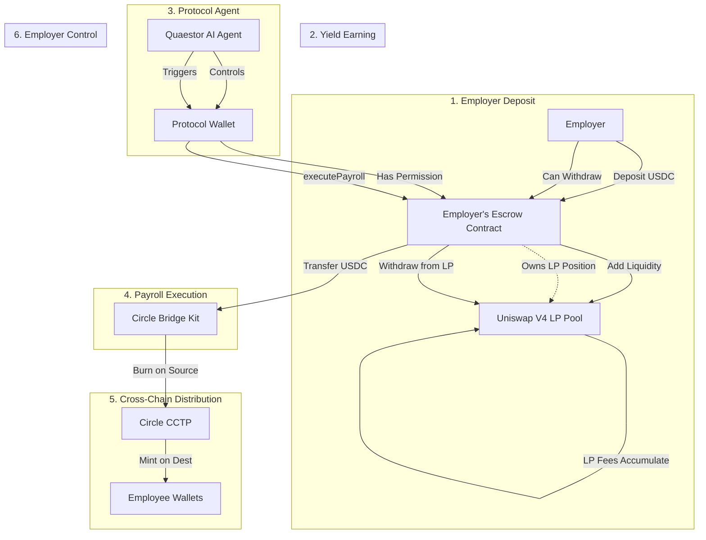
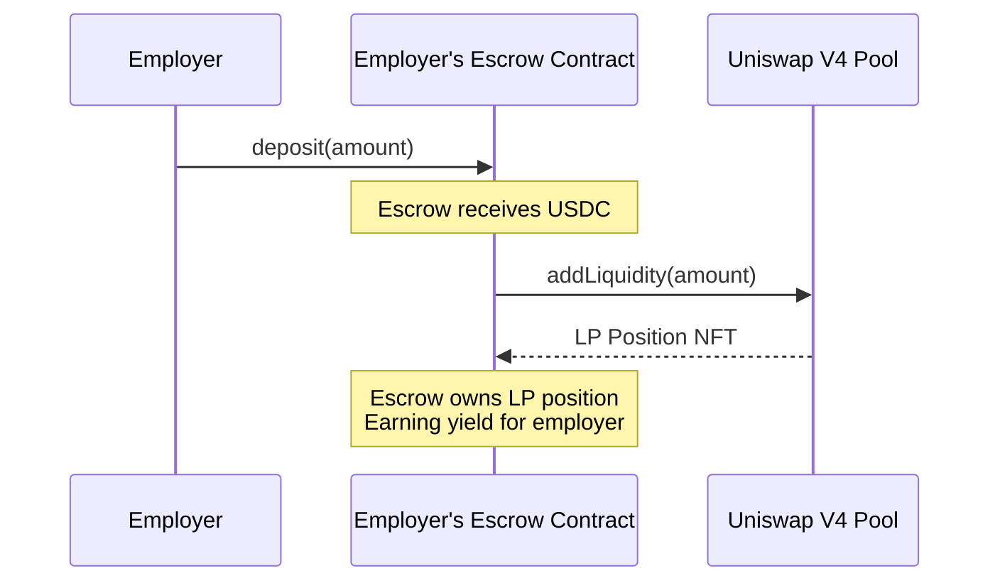
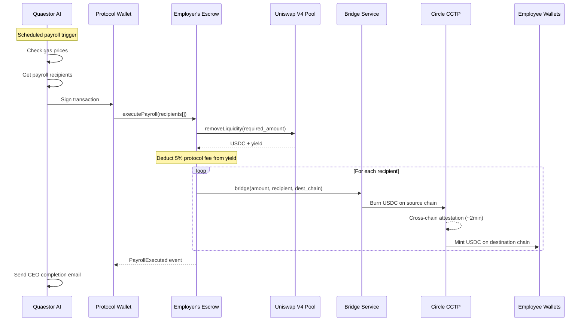
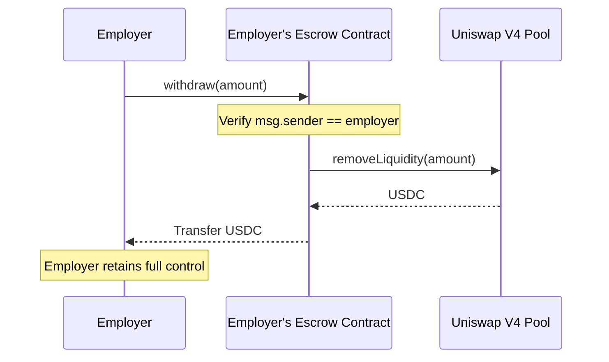

# ArcFlow Payroll - Complete Money Flow

## Architecture Overview



## Key Components

| Component | Owner | Role |
|-----------|-------|------|
| **Escrow Contract** | Employer (1 per employer) | Holds LP position, enforces permissions |
| **Uniswap V4 LP** | Escrow Contract | Earns yield on deposited USDC |
| **Protocol Wallet** | ArcFlow Protocol | Authorized to call `executePayroll()` |
| **Quaestor Agent** | ArcFlow Protocol | AI that decides when/how to pay |
| **Bridge Service** | ArcFlow Protocol | Node.js service for cross-chain transfers |

---

## Protocol Wallet Authorization

The **Protocol Wallet** (`PRIVATE_KEY` in `bridge-service/.env`) is the ArcFlow protocol's address that has special permissions on each employer's escrow contract.

```
┌─────────────────────────────────────────────────────────────────┐
│                     ESCROW CONTRACT                             │
│                                                                 │
│  constructor(employer, protocol) {                              │
│      this.employer = employer;     // Employer's address        │
│      this.protocol = protocol;     // ArcFlow Protocol Wallet   │
│  }                                                              │
│                                                                 │
│  modifier onlyProtocol() {                                      │
│      require(msg.sender == protocol, "Not authorized");         │
│  }                                                              │
│                                                                 │
│  function executePayroll(...) onlyProtocol {                    │
│      // Only Protocol Wallet can call this                      │
│      // Withdraws from LP and bridges to employees              │
│  }                                                              │
└─────────────────────────────────────────────────────────────────┘
```

### How it works:

1. **Escrow Deployment**: When employer creates escrow, the protocol wallet address is set as authorized
2. **Payroll Trigger**: Quaestor AI agent signs transaction with `PRIVATE_KEY`
3. **On-chain Verification**: Escrow contract checks `msg.sender == protocol`
4. **Execution**: If authorized, escrow withdraws from LP and bridges to recipients

### Key Point:

> **The Protocol Wallet does NOT own the funds.** It only has permission to call `executePayroll()`. 
> The Escrow Contract enforces that funds can only go to the configured recipients on the configured chains.

---

## Flow 1: Employer Deposit



---

## Flow 2: Payroll Execution



---

## Flow 3: Employer Withdrawal



---

## Smart Contract Architecture

```
┌─────────────────────────────────────────────────────────────────┐
│                     ESCROW FACTORY                               │
│  - Deploys new escrow per employer                              │
│  - Sets protocol wallet address on each escrow                  │
│  - Tracks all escrows                                           │
└─────────────────────────────────────────────────────────────────┘
                              │
                              │ creates (with protocol address)
                              ▼
┌─────────────────────────────────────────────────────────────────┐
│                   PAYROLL ESCROW (per employer)                  │
├─────────────────────────────────────────────────────────────────┤
│  State:                                                          │
│    - employer: address (owner who deposited)                    │
│    - protocol: address (ArcFlow Protocol Wallet - PRIVATE_KEY)  │
│    - lpPositionId: uint256                                      │
│    - payrollConfig: Recipients[], amounts[], chains[]           │
├─────────────────────────────────────────────────────────────────┤
│  Access Control:                                                 │
│    - onlyEmployer: require(msg.sender == employer)              │
│    - onlyProtocol: require(msg.sender == protocol)              │
├─────────────────────────────────────────────────────────────────┤
│  Employer Functions (onlyEmployer):                              │
│    - deposit(amount) → adds to LP                               │
│    - withdraw(amount) → removes from LP, sends to employer      │
│    - setPayrollConfig(...) → update recipients                  │
│    - pause() → emergency stop                                   │
├─────────────────────────────────────────────────────────────────┤
│  Protocol Functions (onlyProtocol):                              │
│    - executePayroll() → withdraw from LP, bridge to recipients  │
│    ↳ Protocol Wallet (PRIVATE_KEY) is authorized to call this   │
│    ↳ Funds go ONLY to configured recipients, not to protocol    │
└─────────────────────────────────────────────────────────────────┘
                              │
                              │ interacts with
                              ▼
┌─────────────────────────────────────────────────────────────────┐
│                      UNISWAP V4 POOL                            │
│  - Holds USDC liquidity                                         │
│  - Earns LP fees for escrow                                     │
│  - Escrow contract owns the LP position                         │
└─────────────────────────────────────────────────────────────────┘
                              │
                              │ on executePayroll()
                              ▼
┌─────────────────────────────────────────────────────────────────┐
│                   PROTOCOL WALLET (PRIVATE_KEY)                  │
│  - Signs transactions to call executePayroll()                  │
│  - Does NOT hold employer funds                                 │
│  - Only has permission to trigger payroll, not arbitrary withdraw│
│  - Controlled by Quaestor AI Agent                              │
└─────────────────────────────────────────────────────────────────┘
```

---

## Fee Structure

```
Source: Uniswap V4 LP Yield
        │
        ▼
┌───────────────────────────┐
│   Yield Earned: $150.00   │
│   Protocol Fee (5%): $7.50│
│   ─────────────────────── │
│   Net to Employees: $142.50│
└───────────────────────────┘
        │
        ▼
Principal ($50,000) + Net Yield ($142.50) = Total Distribution
```

---

## Permissions Matrix

| Action | Employer | Protocol | Anyone |
|--------|----------|----------|--------|
| `deposit()` | ✅ | ❌ | ❌ |
| `withdraw()` | ✅ | ❌ | ❌ |
| `setPayrollConfig()` | ✅ | ❌ | ❌ |
| `executePayroll()` | ❌ | ✅ | ❌ |
| `pause()` | ✅ | ❌ | ❌ |
| `getBalance()` | ✅ | ✅ | ✅ |

---

## Supported Chains

| Chain | Chain ID | Role |
|-------|----------|------|
| Arc Testnet | 5042002 | Source (LP Pool) |
| Ethereum Sepolia | 11155111 | Source/Destination |
| Base Sepolia | 84532 | Destination |
| Arbitrum Sepolia | 421614 | Destination |
| Optimism Sepolia | 11155420 | Destination |

---

## Environment Variables

### bridge-service/.env
```bash
PORT=3001
PRIVATE_KEY=0x...  # Protocol wallet private key
```

### agent/.env
```bash
USE_BRIDGE_KIT=true
BRIDGE_SERVICE_URL=http://localhost:3001
```

---

## Running the System

```bash
# 1. Start Bridge Service
cd agent/bridge-service
bun run dev

# 2. Start Agent API
cd agent
python -m uvicorn quaestor.api.main:app --reload

# 3. Trigger payroll
curl -X POST http://localhost:8000/trigger-payroll \
  -H "Content-Type: application/json" \
  -d '{"payroll_id": "PAY-2026-001"}'
```

---

## Security Considerations

| Risk | Mitigation |
|------|------------|
| Protocol key compromise | Use multisig wallet (Gnosis Safe) |
| Large unauthorized withdrawal | Add timelock (24-48hr) for amounts > threshold |
| Smart contract bug | Professional audit before mainnet |
| Employer lockout | Emergency `pause()` function |
| Front-running | Use private mempool (Flashbots) |
